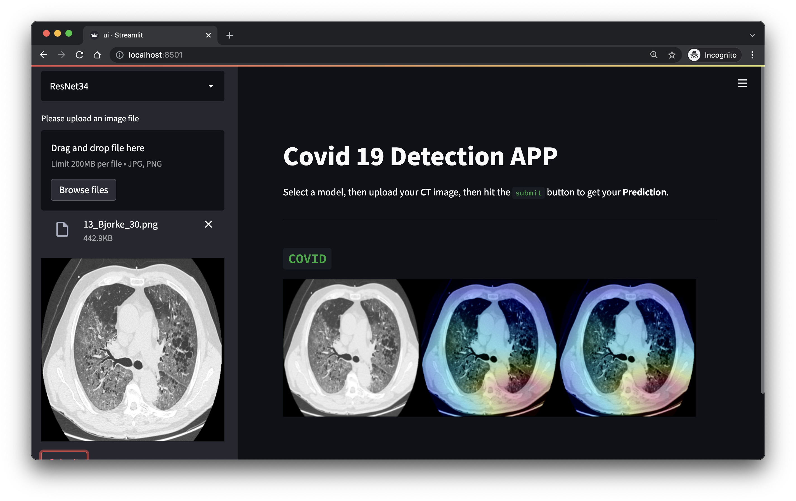

# Covid-CT

## Usage

start backend by running [endpoints.py](./src/endpoints.py)

    python3 endpoints.py

and start UI by running [ui.py](./src/ui.py)

    streamlit run ui.py


## Interface



<br>

## DVC

if you using data version control like **dvc**, use following instruction to download *weights*.<br>
For downloading models, first install `DVC`

    pip install dvc

then use following command to download:

    dvc pull

## Shell

if you want to directly download *weights* and not using dvc, use following instruction:

```
chmod +x ./models/get_weoghts.sh
./models/get_weoghts.sh
```

* Note: Weights stored in *Google Drive* Probably you need to install `gdown`

```
pip3 install gdown
```

